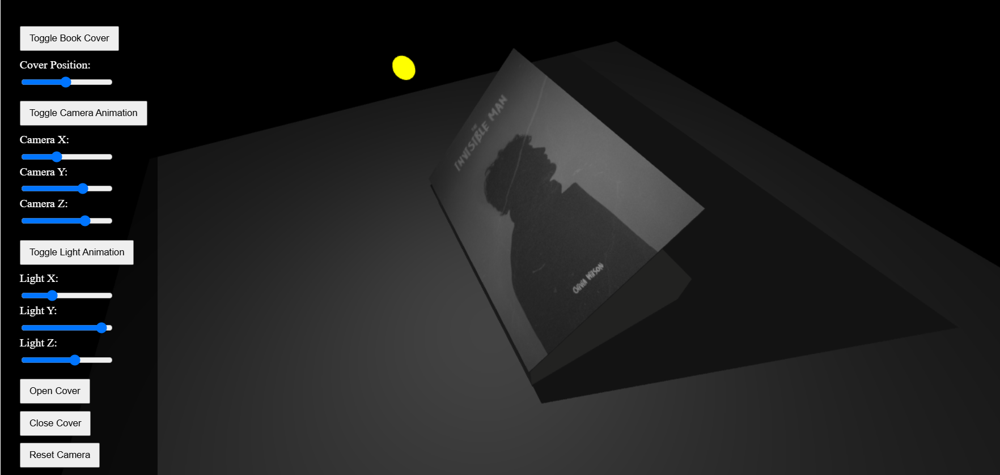

# 3D Book Another

## 3D Interactive Book Viewer

An interactive 3D book visualization project built with Three.js that lets users manipulate and interact with a realistic book model.




## 3D Book Visualization

### Features
- **Realistic 3D Book Model:** Fully textured book (front cover, back cover, and pages)
- **Interactive Controls:**
  - Open/close book cover via slider or buttons
  - Adjust camera position and angle
  - Control light position and intensity
  - Toggle animations for dynamic effects
- **Custom Textures:** Realistic leather cover, paper texture, and detailed page edges
- **Dynamic Lighting & Shadows:** Adjustable lighting with real-time shadow rendering
- **Keyboard Shortcuts:**
  - `O`: Open book cover
  - `C`: Close book cover
  - Arrow keys: Move camera

### Technologies Used
- **Three.js:** JavaScript 3D library
- **Vite:** Next generation frontend tooling

## Installation

Clone the repository:
```bash
git clone https://github.com/mhtafhim/3d-book-another.git
```

Navigate to the project directory:
```bash
cd 3d-book-another
```

Install dependencies:
```bash
npm install
```

Start the development server:
```bash
npm run dev
```

## Usage

After starting the server, open your browser and go to [http://localhost:3000](http://localhost:3000).

### Controls

**Book Cover:**
- Toggle cover animation
- Adjust cover position with the slider
- Open or close the cover with buttons

**Camera:**
- Toggle camera animation (orbiting)
- Adjust X, Y, and Z positions with sliders
- Reset to default position

**Lighting:**
- Toggle light animation (orbiting)
- Adjust X, Y, and Z positions of the light source

## Project Structure

```
3d-book-another/
├── index.html          # Main HTML file with controls
├── js/
│   ├── animation.js    # Animation loops and effects
│   ├── book.js         # 3D book model creation
│   ├── controls.js     # UI and interaction controls
│   ├── main.js         # Main application entry point
│   ├── scene.js        # Three.js scene setup
│   ├── style.css       # UI styling
│   ├── textures.js     # Book texture generation
│   └── front-page.jpg  # Cover image
├── package.json        # Project dependencies
└── vite.config.js      # Vite configuration
```

## Build for Production

Build the project:
```bash
npm run build
```

The build artifacts are stored in the `dist/` directory.

To preview the production build:
```bash
npm run preview
